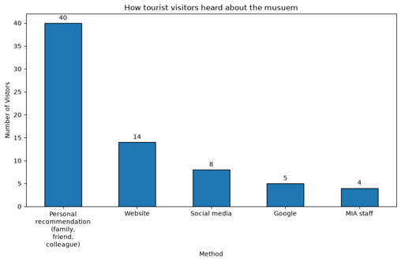

#  National Museum survey and data analysis
---

National Museum visit
---------------------

The visit to the museum for survey was a completely new experience for me. I have never observed visitor behavior or approached strangers for interviews before, so stepping out of my comfort zone took some efforts, but it turned out to be a fun challenge that I enjoyed. An interesting pattern I found while observing people’s behavior was that none of the visitors interacted with the audio tour available except only one person who used it, while the rest didn't pay attention. I believe it's an accessibility issue. For example, one of the audios QR codes was in the middle between 2 big paintings in G04, this causes the visitor to pay more attention to the paintings and overlooking the QR code. Adding a clear visual indicator could solve this and guide the visitors to the audio content. Out of the different visitors, one outlier stood out. A young adult who was moving methodically in the different galleries, he would spend around 5 minutes reading the text carefully, but what is more surprising is he rarely interacted with interactive screens or audio tours. Another visitor who I talked to didn’t know that the screens are interactive, I had to show him that he can interact and learn new information from the interactive screens. What I learned the most from this experience was how people observe and behave differently inside museums, some prefer reading text, others prefer interactive screens or movies, and while some move randomly and others methodically, all of this helps different habits are important when building museums. 

Data Analysis
-------------------
A survey with 200 respondents from different ages and nationalities, where I did data analysis for it to find insight and what observation I can reach with it. Instead of using tools I already knew, I decided to challenge myself by learning Pandas and Jupyter Notebooks. I ran into some problems while setting up the virtual environments and installing the dependencies. The process took longer than I expected. I scanned the dataset to build a solid understanding of the data for the report and structure the report. From all the data available, I’m still surprised with how tourists heard about the museum, only 10 of 200 heard about the museum from social media, as shown in the figure below. With today’s world where social media is the most important pillar in marketing, I expected that number to be higher. Working with Pandas and Jupyter notebook was interesting experience. How it is possible to simply call a function to run complex calculations, to compare multiple columns to find hidden patterns in the data and being able to output visual charts of the results. What I learned the most from this experience was the ability to find out hidden patterns and problems that others may have overlooked and how 2 seemingly separated data columns can result in a strong correlation.  

  

